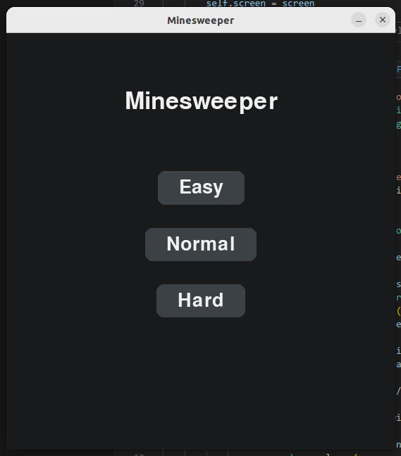
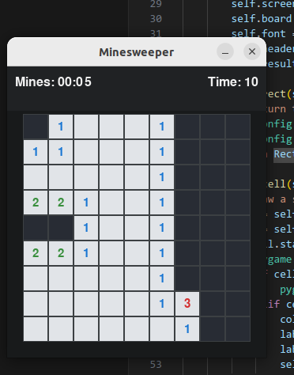

# Selective difficulties

- User can select difficulty at the game starts.
- It has three options:
    1. Easy
    2. Normal
    3. Hard
- This feature was implemented by [SimSeoJin](https://github.com/SimSeoJin).

# Timer

- The timer now showed on the top of the display.
- Currently it has been swaped with the number of mine.
- This feature was implemented by [SimSeoJin](https://github.com/SimSeoJin).
